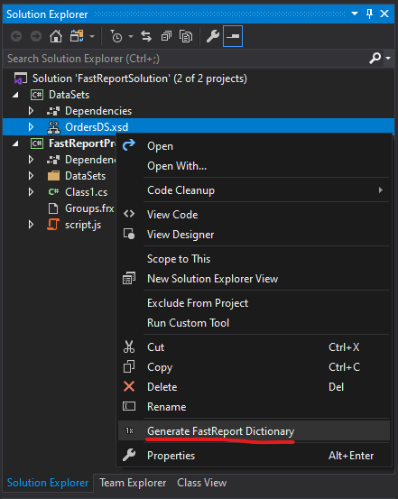
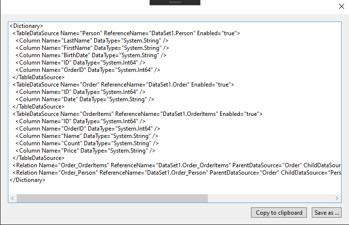
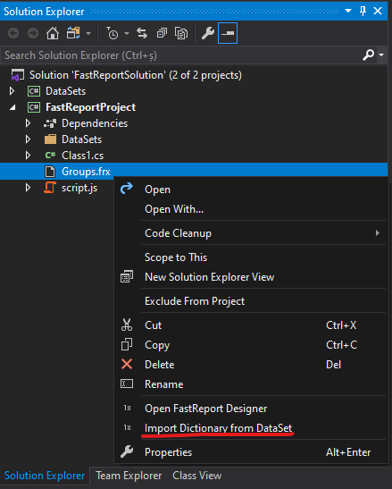
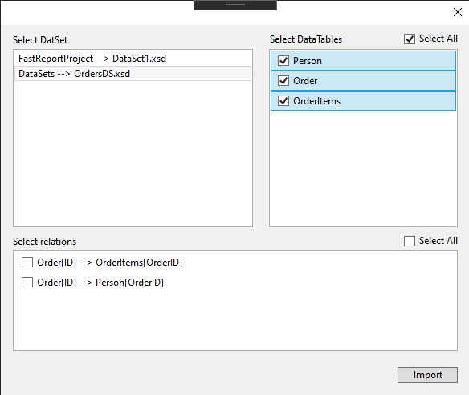
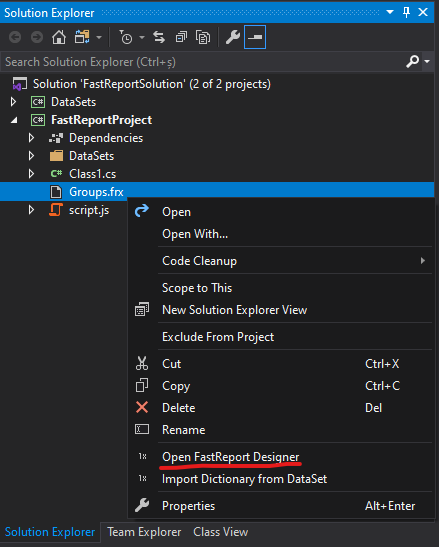
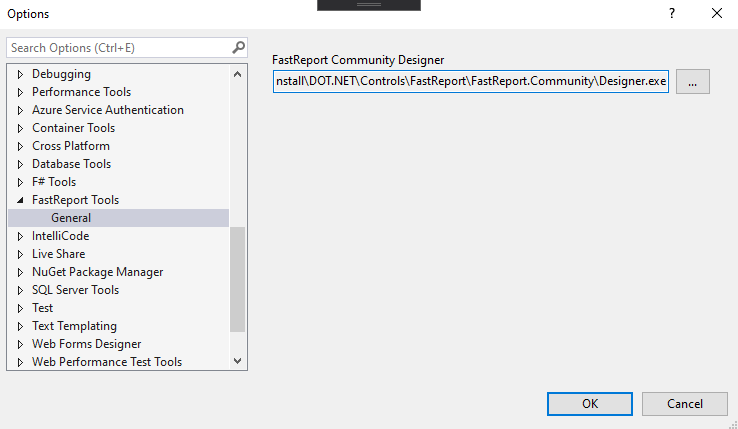

# FastReport Tools
A Visual Studio extention for easily working with open source FastReport report generator. It can be used for generate FastReport Dictionary(.frd) from DataSets, Import FastReport Dictionary from a DataSet to an existing Report (.frx), Open Fast Report Community Edition Designer using Solution Explorer context menu.

### Generate FastReport Dictionary(.frd) from DataSet
To generate FastReport Dictionaty from a DataSet go to Solution Explorer right clik on DataSet you want an select from context menu "Generate FastReport Dictionary"

In new opened window you be able to copy FastReport Dictionary to clipboard o save it to file(.frd)

### Import FastReport Dictionary from a DataSet to a Report (.frx)
To import FastReport Dictionary from a DataSet to an existing Report go to Solution Explorer right clik on report file(.frx) and select "Import Dictionary from DataSet"

From the opened window select DataTables and Relations you want to import

Click on Import button to add selected tables and relations into selected report

### Open Fast Report Community Edition Designer
To open a FastReport report file in Community Edition Designer in Solution Explorer right click on a report file(.frx) and select "Open FastReport Designer"

A new Community Edition Designer windows will open

#### Setting FastReport Community Edition Designer install location
Then you will open designer for first time you will be asked to select the location of designer.
Later you can change location in Visual Studio main menu Tools -> Options -> FastReport Tools

# Licenses

The VFS for Git source code in this repo is available under the MIT license. See [License.md](License.md).
